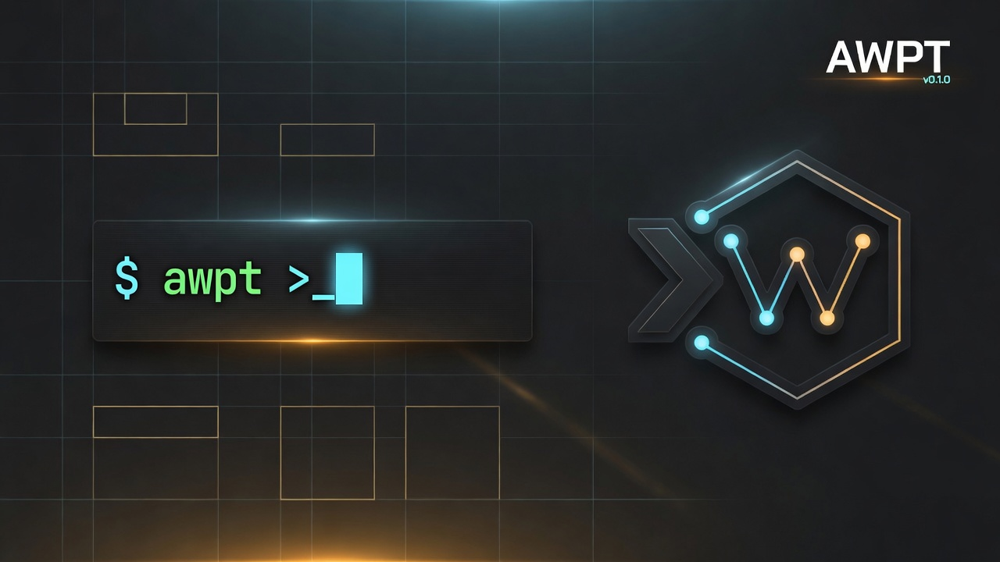

# Agent WordPress Terminal (AWPT)

<p align="center">
  
</p>

**A WordPress-native terminal for agent-assisted site work.**

AWPT is an admin cockpit where you chat with an AI agent that can inspect your site, retrieve Knowledge, call Abilities/MCP tools, and stage content changes for you to approve — not a fire-and-forget automation bot.

| | |
|---|---|
| **Requires** | WordPress 6.9+, PHP 8.4+ |
| **Where** | Settings → Agent Terminal |
| **Providers** | OpenRouter or OpenAI API keys (WordPress Connectors optional) |
| **Status** | MVP `0.1.0` |

## What it does

- **Chat terminal** in wp-admin with sessions, tool calls, and staged action cards
- **Open tool discovery** — site Abilities and WordPress MCP tools are available; turn individual tools off if you want
- **Block-aware editing** — path/fingerprint block tree, propose attr updates, insert/remove blocks
- **Knowledge** — index site content, theme files, docs, and PDFs; keyword search with optional hybrid embeddings
- **Human-in-the-loop writes** — destructive or content-changing work is proposed, previewed, then applied only on approval

## Quick start

```bash
composer install
npm install
npm run build
```

Activate the plugin in WordPress, open **Settings → Agent Terminal**, add an OpenRouter or OpenAI key, and start a session.

```bash
composer run check   # PHP lint + analyze
composer run test    # bootstrap-free PHP tests
npm run lint         # Biome
npm run build        # production assets → build/
```

## Architecture (short)

```
Abilities  →  what WordPress can do
MCP        →  how tools are discovered/run (in-process bridge when present)
AWPT UI    →  where you collaborate and approve
```

| Path | Role |
|------|------|
| `agent-wordpress-terminal.php` | Bootstrap |
| `src/Agent/` | Runtime, providers, tool registry |
| `src/Abilities/` | `awpt/*` abilities |
| `src/Knowledge/` | Index, search, embeddings, filesystem roots |
| `src/MCP/` | MCP adapter + WordPress MCP bridge |
| `assets/` | React terminal UI (Vite) |

For contributor detail, see [`AGENTS.md`](./AGENTS.md). Product intent lives in [`plan.txt`](./plan.txt) and [`PRODUCT.md`](./PRODUCT.md).

## Releases

Version **0.1.0** is the MVP cut. Installable zips are built by GitHub Actions when a version tag is pushed.

### Cutting a release

1. Bump the version in **all three** places (they must match the tag without the `v` prefix):
   - `agent-wordpress-terminal.php` plugin header `Version:`
   - `AWPT_VERSION` constant in the same file
   - `package.json` `"version"`
2. Commit the bump on `master`.
3. Tag and push:

```bash
git tag -a v0.1.0 -m "Release 0.1.0"
git push origin master
git push origin v0.1.0
```

The [Release](.github/workflows/release.yml) workflow will:

- install production Composer deps + build frontend assets
- package `agent-wordpress-terminal.zip` (installable plugin folder)
- create a GitHub Release with the zip attached

Local dry-run (same packaging as CI):

```bash
./bin/build-plugin-zip.sh
# → agent-wordpress-terminal.zip in the repo root
```

## License

GPL-2.0-or-later
